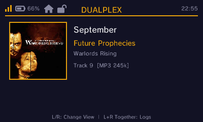
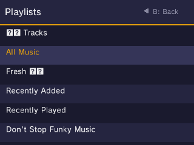
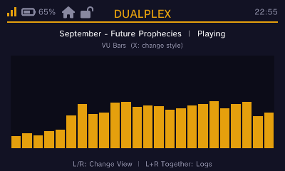
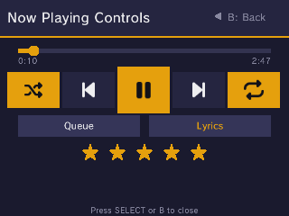
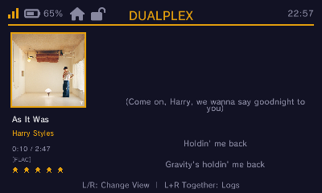

# DualPlex

A Plex music client for the Nintendo 3DS family of systems, using the HTTP API to stream music.

## Screenshots
| | |
|---|---|
|  Now Playing (top screen) |  Playlists (bottom screen) |
|  Visualizer (top screen) |  Now Playing Controls (bottom screen) |
|  Lyrics (top screen) | |

## Features
- Sign in with your Plex account via a `plex.tv/link` code or direct username/password
  (with two-factor support), or skip the account and enter a server URL/token by hand.
  Signing in through the account also lists your available servers and picks a reachable
  address for each automatically.
- Browse by Artists → Albums → Tracks, browse Playlists, search your library by title, or
  jump straight into Recently Added
- Playback status; volume follows the console's physical volume slider, like any other 3DS app
- Adaptive stream quality: direct FLAC on New3DS, MP3 transcodes at lower bitrates elsewhere,
  auto-downgrading mid-playback if the connection can't keep up
- Smart crossfade between tracks: two independent decode/NDSP-channel "decks"
  let the next track fade in while the current one is still playing. When
  Plex's Sonic Analysis data is available for a track (Plex Pass required),
  the fade is timed to the quietest moment near the track's end rather than
  a fixed final few seconds, and levels are matched between tracks using
  Plex's own loudness-normalization gain. Falls back to a plain fixed-length
  crossfade for unanalyzed tracks.
- Time-synced lyrics view, an audio visualizer with several styles, and a dedicated
  Now Playing Controls screen with a Play Queue / Up Next view
- Star ratings - tap a star on the Now Playing Controls screen to rate the current track;
  it's saved back to your Plex library
- Shuffle and repeat (off/all/one), previous/next, and seek by tapping the progress bar
- Playback keeps going with the 3DS lid closed instead of being suspended
- On-screen live log viewer for troubleshooting
- Settings screen for 12/24-hour clock format and toggling crossfade

## Prerequisites
To compile this project, you will need `devkitPro` with the following packages installed:
- `3ds-dev`
- `3ds-curl`
- `3ds-mpg123`
- `3ds-mbedtls`

## Setup
1. Clone this repository: `git clone <repo>`
2. Run the setup script to download required third-party libraries (e.g. cJSON):
   - Windows: Run `setup.bat`
   - Linux/macOS: Run `./setup.sh`

## Building
Run `make` in the root of the project to build `DualPlex.3dsx`.

## First Launch
On first launch, DualPlex walks you through choosing how to connect:
- **Link with plex.tv**: shows a code to enter at `plex.tv/link`, then lists the servers
  on your account to pick from
- **Sign in directly**: username/password (with a 2FA code if your account needs one),
  then the same server list
- **Manual setup**: type a server URL and Plex token yourself, no account sign-in required

Whichever path you take, the result is saved to `/3ds/dualplex/config.txt` on your SD card
so you won't have to sign in again. If you're upgrading from the old "3DS Plex Client" build,
an existing config at `/3ds/3ds-plex-client/config.txt` is picked up automatically and copied
to the new location.

For manual setup, a `config.txt` looks like:
```
server_url=http://192.168.1.100:32400
auth_token=YOUR_PLEX_TOKEN
```

## Controls
- **A**: Select / Play / Pause
- **Y**: Play / Pause
- **B**: Back / Stop
- **D-Pad**: Navigate menus
- **SELECT**: Jump to the Now Playing Controls screen (press again to return)
- **L/R**: Cycle the top screen between Now Playing, Lyrics, and Visualizer views
- **L+R together**: Toggle the live log viewer
- **X**: Change visualizer style (while the Visualizer view is active)
- **New 3DS C-Stick up/down**: Navigate lists
- **New 3DS C-Stick left/right**: Toggle shuffle / cycle repeat mode (off → all → one)
- **New 3DS ZL/ZR**: Previous / next track
- **Touch the progress bar** (Now Playing Controls, bottom screen): seek to that point in the track
- **Touch a star** (Now Playing Controls, bottom screen): rate the current track; tapping the
  already-topmost star clears the rating
- **Now Playing Controls** (bottom screen) also has touch buttons for shuffle, prev,
  play/pause, next, repeat, and jumping to the Play Queue
- **START+SELECT**: Exit application

## Project Structure
- `source/`: Contains the main application C source files
- `source/lib/`: Third-party dependencies (like cJSON)
- `gfx/`: Graphical assets
- `romfs/`: File assets to pack into the RomFS
- `data/`: Additional data files
- `tests/`: Host-run unit tests (`make -f tests/Makefile`) - see `tests/README.md`

## License
MIT License.

Playback control icons use [Font Awesome Free](https://fontawesome.com) 6.5.1 (solid style),
licensed under the [SIL OFL 1.1](licenses/fontawesome-LICENSE.txt); only the handful of glyphs
actually used are baked into `data/iconfont.bin` and linked directly into the binary.
